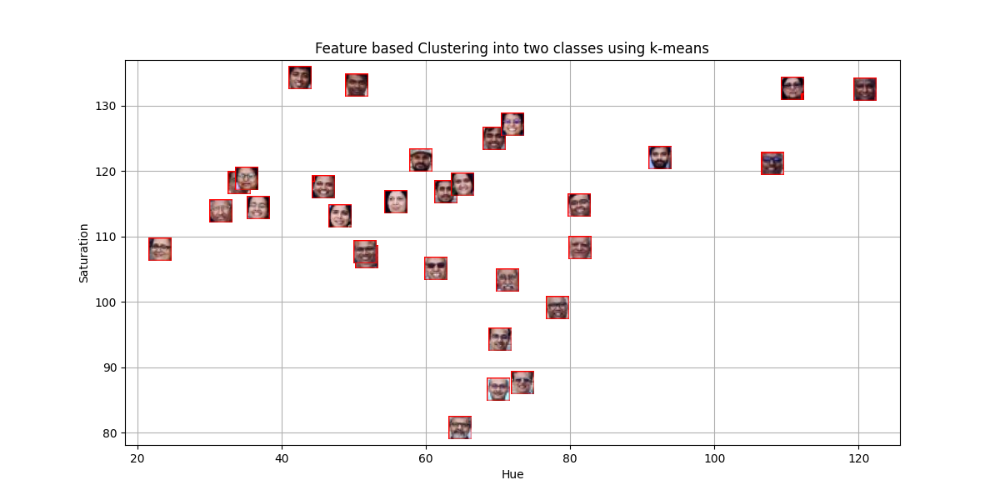

#### Description :

I have applies  **K-Means clustering for distance-based classification** , utilizing **hue and saturation features** extracted from facial images (**Plaksha_Faculty.jpg** and  **Dr_Shashi_Tharoor.jpg** ). It explores the effectiveness of clustering in distinguishing facial features based on color properties and demonstrates the impact of **feature scaling, optimal cluster selection (Elbow Method), and different distance metrics** on classification performance. Additionally, the project adheres to best practices in  **version control, automation, containerization, and experiment tracking** , ensuring reproducibility and efficiency.

#### Plots:

#### Report :

#### 1. What are the common distance metrics used in distance-based classification algorithms?

answer ->Euclidean , Mahalanobis , Manhattan, Chebyshev, Minkowski ,Cosine, Hamming

#### 2. What are some real-world applications of distance-based classification algorithms?

answer ->  Face Recognition ,Product Categorization, Malware Categorization ,Emotion Classification , Fraud Detection ,  Disease Classification , Speech Recognition

#### 3. Explain various distance metrics.

answer -> Euclidean Distance: Measures the straight-line distance between two points in a multi-dimensional space.

Mahalanobis Distance: Accounts for correlations in the dataset and scales data based on variance. It is useful in multivariate data.

Manhattan Distance (Taxicab Distance): Measures distance by summing absolute differences along each axis. Used when movement is restricted to grid-based paths.

Chebyshev Distance: Measures the maximum absolute coordinate difference; useful for scenarios where diagonal movement has the same cost as horizontal/vertical movement.

Minkowski Distance: A generalization of both Euclidean and Manhattan distances, controlled by parameter p. When p=2, it becomes Euclidean; when p=1, it becomes Manhattan.

Cosine Similarity (Not technically a distance metric): Measures the cosine of the angle between two vectors, useful for text similarity. Distance is typically defined as 1 - cosine similarity.

Hamming Distance: Counts the number of differing positions between two strings or binary sequences. Used in error detection, coding theory, and text processing.

#### 4. What is the role of cross validation in model performance?

answer ->Cross-validation helps assess a model’s ability to generalize by repeatedly splitting the dataset into training and testing subsets. It reduces overfitting risks and ensures a more robust estimate of performance across different data splits.

#### 5. Explain variance and bias in terms of KNN?

answer ->Variance: Sensitivity to small changes in training data. A low k (e.g., k=1) makes the model highly responsive to individual data points, increasing variance.

Bias: The difference between predicted values and actual values. A high k (e.g., k=20) smooths predictions, reducing variance but increasing bias, as it may not capture local patterns.

## Wandb  Dashboard:

